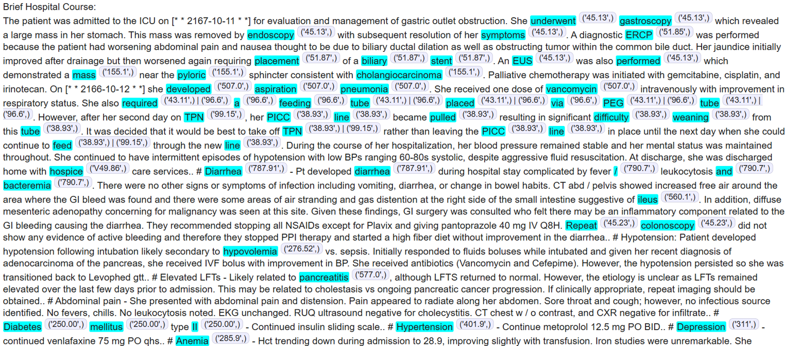
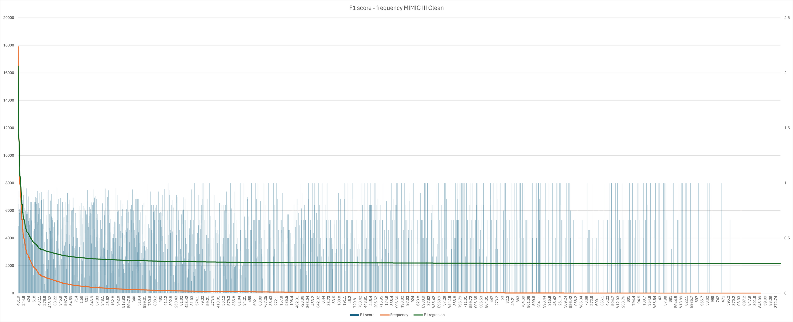
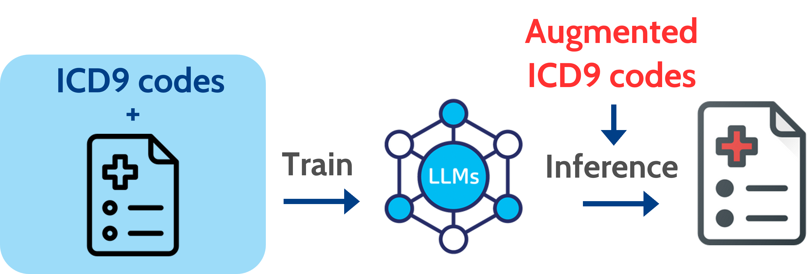

# Trustworthy Clinical note with Large language model

Code from our graduate thesis, University of Science, VNU-HCMC.
Authors: Hai-Chan Nguyen, Phuong-Thuy Le-Nguyen

# What's new?

We built this project on top of the work by Edin et. al [Explainable Medical Coding ](https://github.com/JoakimEdin/explainable-medical-coding). In our work, we add in:

- **Invert Label-cross Attention**: We introduce a new attention-based explanation technique for Automatic Medical Coding by inverting the direction of attention—from clinical notes to ICD labels. This approach achieves performance comparable to the state-of-the-art method of Edin et al., while offering fresh insights into the interpretability of attention weights without requiring additional explanation-enhancing training.
<p align="center">
  
</p>

- **Clinical note synthesize**: We present a novel pipeline for synthesizing clinical notes that complies with MIMIC dataset privacy regulations by fine-tuning a locally hosted, medically pre-trained LLM (BioGPT-Large). The synthesized notes effectively mitigate the skewed distribution of ICD codes observed in real-world clinical documentation.

<p align="center">
  
  
</p>

Our implementation of Inverted Label-Cross Attention is integrated within the explainable_medical_coding directory, while most of the note-synthesis components reside under the notebook directory.

The following setting is copied from the [Explainable Medical Coding ](https://github.com/JoakimEdin/explainable-medical-coding).

# Setup

While our paper only presented results on MIMIC-III and MDACE, our code also supports experiments on MIMIC-IV. Here is a guide to setting up the repository for experimentation and reproducibility. Notice that you will need +100 GB of storage to fit everything.

1. Clone this repository.
2. cd explainable_medical_coding
3. `cd data/raw`
4. Install [MIMIC-IV](https://physionet.org/content/mimiciv/2.2/) using wget (we used version 2.2)
5. Install [MIMIC-IV-Note](https://physionet.org/content/mimic-iv-note/2.2/) using wget (we used version 2.2)
6. Install [MIMIC-III](https://physionet.org/content/mimiciii/1.4/) using wget (we used version 1.4)
7. Back to the main repository folder `cd -`
8. Use a virtual environment (e.g., conda) with python 3.11.5 installed.
9. Create a weights and biases account. It is possible to run the experiments without wandb.
10. Prepare code, datasets and models using the command: `make prepare_everything`. Go grab an enourmous coffee.

You are now all set to run experiments!

Instead of using `make prepare_everything`, you can run it in multiple steps. This can be useful if you don't have storage for everything. E.g., if you don't need the model weights which takes +70GB of storage.

1. Enter `make setup`. It should install everything you need to use the code.
2. prepare the datasets and download the models using the command
3. Prepare datasets. `make mimiciii`, `make mimiciv`, `make mdace_icd9`.
4. Download RoBERTa-base-PM-M3-Voc which is necessary for training PLM-ICD `make download_roberta`
5. Download the 10 runs of the PGD, IGR, TM, B_S and B_U. They require 70GB of storage. `make download_models` (the command is slow to execute)

# Note on licenses

## Explainable Medical Coding

We have reused lots of material from the work of Edin et. al. If you use the this work, remember to cite the authors:

```
@misc{edinUnsupervisedApproachAchieve2024,
  title = {An {{Unsupervised Approach}} to {{Achieve Supervised-Level Explainability}} in {{Healthcare Records}}},
  author = {Edin, Joakim and Maistro, Maria and Maal{\o}e, Lars and Borgholt, Lasse and Havtorn, Jakob D. and Ruotsalo, Tuukka},
  year = {2024},
  month = jun,
  number = {arXiv:2406.08958},
  eprint = {2406.08958},
  primaryclass = {cs},
  publisher = {arXiv},
  urldate = {2024-06-14},
  abstract = {Electronic healthcare records are vital for patient safety as they document conditions, plans, and procedures in both free text and medical codes. Language models have significantly enhanced the processing of such records, streamlining workflows and reducing manual data entry, thereby saving healthcare providers significant resources. However, the black-box nature of these models often leaves healthcare professionals hesitant to trust them. State-of-the-art explainability methods increase model transparency but rely on human-annotated evidence spans, which are costly. In this study, we propose an approach to produce plausible and faithful explanations without needing such annotations. We demonstrate on the automated medical coding task that adversarial robustness training improves explanation plausibility and introduce AttInGrad, a new explanation method superior to previous ones. By combining both contributions in a fully unsupervised setup, we produce explanations of comparable quality, or better, to that of a supervised approach. We release our code and model weights.},
  archiveprefix = {arxiv},
  langid = {english},
  keywords = {Computer Science - Machine Learning},
  file = {/Users/joakimedin/Zotero/storage/Z7WAXDTU/Edin et al. - 2024 - An Unsupervised Approach to Achieve Supervised-Level Explainability in Healthcare Records.pdf}
}
```

## MIMIC

You need to obtain a non-commercial licence from physionet to use MIMIC. You will need to complete training. The training is free, but takes a couple of hours. - [link to data access](https://physionet.org/content/mimiciii/1.4/)

## Model weights can only be used non-commercially

While we would love to make everything fully open source, we cannot. Becaue MIMIC has a non-commercial license, the models trained using that data will also have a non-commercial licence. Therefore, using our models or RoBERTa-base-PM-M3-Voc's weights for commercial usecases is forbidden.

# How to run experiments

## How to train a model

You can run any experiment found in `explainable_medical_coding/configs/experiment`. Here are some examples:

- Train PLM-ICD on MIMIC-III full and MDACE on GPU 0: `poetry run python train_plm.py experiment=mdace_icd9_code/plm_icd gpu=0`
- Train PLM-ICD using the supervised approach proposed by Cheng et al. on MIMIC-III full and MDACE on GPU 0: `poetry run python train_plm.py experiment=mdace_icd9_code/plm_icd_supervised gpu=0`
- Train PLM-ICD using input gradient regularization on MIMIC-III full and MDACE on GPU 0: `poetry run python train_plm.py experiment=mdace_icd9_code/plm_icd_igr gpu=0`
- Train PLM-ICD using token masking on MIMIC-III full and MDACE on GPU 0: `poetry run python train_plm.py experiment=mdace_icd9_code/plm_icd_tm gpu=0`
- Train PLM-ICD using projected gradient descent on MIMIC-III full and MDACE on GPU 0: `poetry run python train_plm.py experiment=mdace_icd9_code/plm_icd_pgd gpu=0`
- Train PLM-ICD on MIMIC-III full and MDACE on GPU 0 using a batch_size of 1: `poetry run python train_plm.py experiment=mdace_icd9_code/plm_icd gpu=0 dataloader.max_batch_size=1`
- Train PLM-ICD on MIMIC-IV ICD-10 and MDACE on GPU 0: `poetry run python train_plm.py experiment=mdace_icd9_code/plm_icd gpu=0 dataloader.max_batch_size=1 data=mimiciv_icd10`

# Evaluation of feature attribution methods

We also use hydra condig file for evaluating the feature attribution methods methods. The config file is found in `explainable_medical_coding/configs/explainability.yaml`. In the config file, you can chose which explanation methods you would like to use and using which model. The script expects the model weights to be in the models folder. Here are some examples:

- Evaluate using all the feature attribution methods in the config file on the model weights found in the models/unsupervised/gice8s68. Store the results in a folder results/explainability_results/baseline: `poetry run python eval_explanations.py gpu=0 run_id=unsupervised/gice8s68 model_name=baseline`
- Only evaluate AttInGrad and Attention: `poetry run python eval_explanations.py gpu=0 run_id=unsupervised/gice8s68 model_name=baseline explainers=[grad_attention, laat]`
- Only evaluate AttInGrad and don't evaluate faithfulness (which is a slow evaluation metric): `poetry run python eval_explanations.py gpu=0 run_id=unsupervised/gice8s68 model_name=baseline explainers=[grad_attention] evaluate_faithfulness=False`
- evaluate multiple models sequentially: `poetry run python eval_explanations.py gpu=0 --multirun run_id=unsupervised/jdjr2y77,unsupervised/pati4i3b,unsupervised/ov55kelz,unsupervised/l2qznkbe model_name=baseline`
